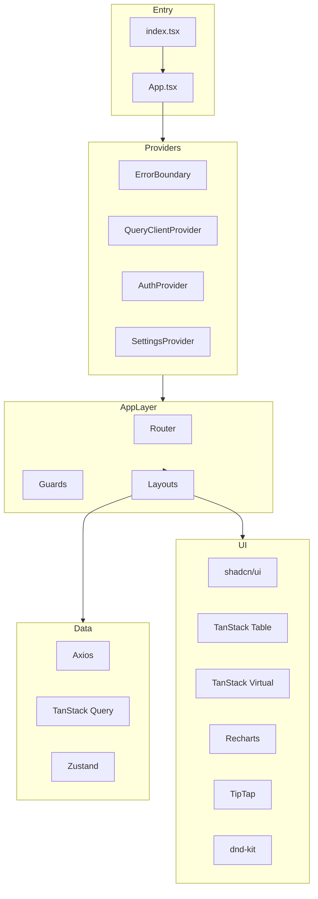

# Architecture

## Overview

This boilerplate follows a **feature-aware flat structure** — files are organized by their role (components, hooks, services) rather than by feature, which keeps the codebase navigable for small-to-medium projects.

## Architecture Diagram



## Directory Breakdown

### `src/components/`

Reusable UI components shared across pages. Each component is a single file in kebab-case.

Sub-directories group related components:

- **`animate/`** — Framer Motion wrappers (`motion-container`, `motion-viewport`, `text-animate`)
- **`form/`** — React Hook Form + shadcn field wrappers (`rhf-text-field`, `rhf-select`, etc.)
- **`nav-section/`** — Navigation components (vertical/horizontal nav items)
- **`settings/`** — Theme settings drawer (mode, contrast, direction, presets)
- **`table/`** — TanStack Table (DataTable), pagination, skeleton, empty rows
- **`charts/`** — Recharts wrappers (LineChart, BarChart, PieChart)
- **`editor/`** — TipTap rich text editor
- **`upload/`** — File upload components (single, multi, avatar)

### `src/contexts/`

React contexts for cross-cutting concerns:

- **`jwt-context.tsx`** — Authentication state (login, logout, token refresh)
- **`settings-context.tsx`** — Theme settings (mode, direction, presets, contrast)
- **`collapse-drawer-context.tsx`** — Dashboard sidebar collapse state

### `src/guards/`

Route protection components:

- **`auth-guard.tsx`** — Redirects unauthenticated users to login
- **`guest-guard.tsx`** — Redirects authenticated users away from login
- **`role-based-guard.tsx`** — Shows "Permission Denied" if user lacks required role

### `src/hooks/`

Custom React hooks:

- **`use-auth.ts`** — Access auth context
- **`use-settings.ts`** — Access settings context
- **`use-responsive.ts`** — Breakpoint queries (`isDesktop`, `isMobile`)
- **`use-local-storage.ts`** — Synced localStorage state
- **`use-query-auth.ts`** — TanStack Query mutations for auth API
- **`use-query-user.ts`** — TanStack Query hooks for user API

### `src/layouts/`

Page layout components:

- **`main/`** — Public marketing layout (header, footer)
- **`dashboard/`** — Authenticated dashboard (sidebar, header, content area)
- **`logo-only-layout.tsx`** — Minimal layout for error pages

### `src/services/`

API layer — Axios service functions organized by domain:

- **`auth/`** — Login, logout, refresh token, password reset
- **`user/`** — User CRUD operations

### `src/store/`

Zustand stores for client-side state:

- **`use-app-store.ts`** — Global app state (loading, error)

### `src/test/`

Testing utilities:

- **`setup.ts`** — Jest-dom, matchMedia, ResizeObserver mocks
- **`test-utils.tsx`** — `renderWithProviders`, `createWrapperForRenderHook`

### `src/types/`

Shared TypeScript interfaces and types.

### `src/utils/`

Utility functions:

- **`axios.ts`** — Configured Axios instance with interceptors
- **`jwt.ts`** — Token validation and session management
- **`format-number.ts`**, **`format-time.ts`** — Formatting utilities

## Data Flow

```
User Action → Component → Hook/Service → API (Axios)
                ↓                           ↓
              Zustand (client state)    TanStack Query (server state)
                ↓                           ↓
              Re-render ← ← ← ← ← ← ← Cache Update
```

### State Management Strategy

| State Type | Tool | Example |
|---|---|---|
| Server data | TanStack React Query | User list, API responses |
| Client UI state | Zustand | Loading indicators, modals |
| Theme/settings | React Context | Dark mode, language, RTL |
| Auth state | React Context + useReducer | Login status, current user |
| Form state | React Hook Form | Form values, validation |
| URL state | React Router | Current route, query params |

## File Naming Convention

All files use **kebab-case**:

- Components: `loading-screen.tsx`, `error-boundary.tsx`
- Hooks: `use-auth.ts`, `use-responsive.ts`
- Utils: `format-number.ts`, `css-styles.ts`
- Types: `auth.ts`, `response.ts`

Component names in code remain **PascalCase** (React convention).
